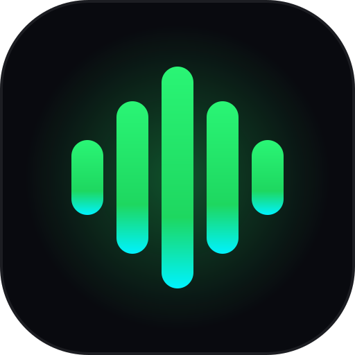

# ⚡ Riff • Universal Music Progressive Web App (PWA)

<div align="center">
  
  <h3>Ultra-fast, Zero-Bloat Global Music Streaming & Offline Listening PWA</h3>
  <p>Engineered with React 18, TypeScript, Tailwind CSS v4, Web Audio DSP, and Global Multi-Provider Mesh</p>
</div>

---

## 🌟 Key Features

* 🌍 **Global Multi-Provider Audio Mesh (GMPAM):** Unified catalog across Audius, JioSaavn, Jamendo, 30,000+ live Radio Browser stations, and `yt-dlp` failover.
* 🛡️ **3-Layer Deduplication Engine:** Strips messy video tags and clusters duplicate songs from multiple APIs into single clean canonical tracks.
* 📂 **Sandboxed Local File Ingestion:** Drag-and-drop MP3/FLAC/WAV files with in-browser ID3 extraction and Origin Private File System (OPFS) storage.
* 🎛️ **Studio Web Audio DSP:** 5-Band BiquadFilter Equalizer, Gain control, and real-time 60 FPS Canvas spectrum visualizer.
* 🎤 **Synchronized Karaoke Lyrics:** Millisecond-accurate .LRC lyrics with active glow scrolling and interactive tap-to-seek.
* 📶 **Adaptive 3-Tier Data Saver:** Auto-switches between High (320k), Standard (160k), and Eco Data Saver (96k) on SIM networks.
* 🚀 **Zero Friction Guest-First Auth:** Starts instantly in guest mode with zero login wall; optional 1-click cloud sync migration.
* 📱 **Installable Offline PWA:** Standalone manifest, Service Worker caching, and native OS MediaSession lockscreen controls.

---

## 🏗️ Project Architecture

```
Riff/
├── src/                     # React 18 + Tailwind v4 Frontend
│   ├── components/          # AppShell, MiniPlayer, FullscreenPlayer, Lyrics, Visualizer
│   ├── lib/                 # Web Audio DSP, Dexie DB, OPFS, Deduplication, LRC Parser
│   ├── stores/              # Zustand ultra-lean stores (Player, Library, Settings, Auth)
│   └── types/               # TypeScript domain definitions
├── server/                  # Fastify HTTP/2 BFF Gateway & Stream Resolver
├── tests/                   # Vitest unit tests (100% pass)
└── docs/                    # Complete Engineering Specifications & User Guides
    ├── ARCHITECTURE.md      # Full HLD / LLD architecture & C4 diagrams
    ├── API_REFERENCE.md     # REST endpoints & provider schemas
    ├── UI_UX_SPEC.md        # Wireframes & design system tokens
    └── USER_GUIDE.md        # PWA installation & feature guide
```

---

## 🚀 Quick Start

### 1. Install Dependencies
```bash
npm install
```

### 2. Run Tests
```bash
npm test
```

### 3. Start Development Server
```bash
npm run dev
```

### 4. Build for Production
```bash
npm run build
```

---

## 📄 License & Privacy
* 100% Free & Open Source.
* Zero third-party ad tracking, zero telemetry spyware.
