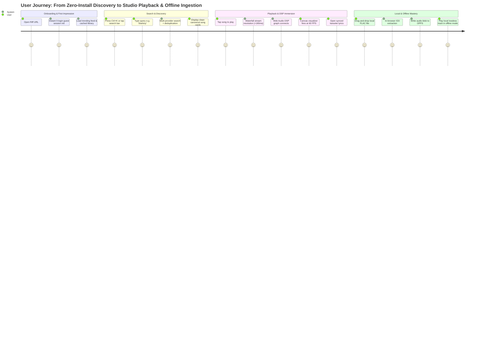
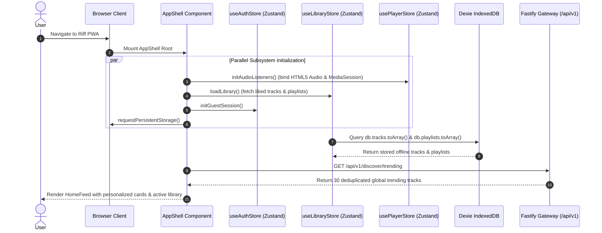
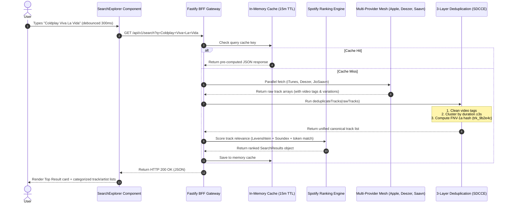
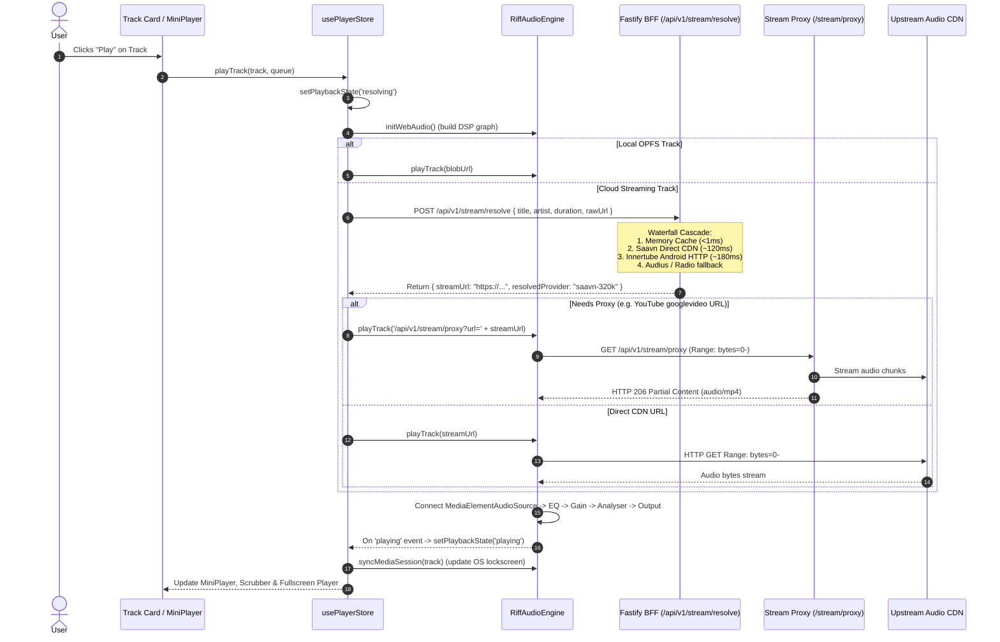
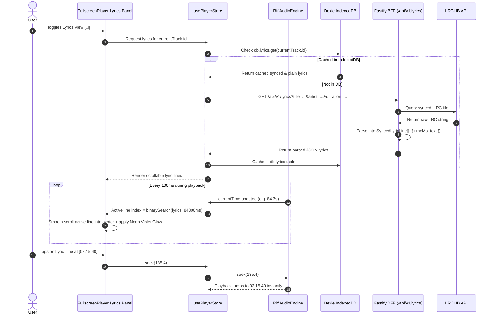
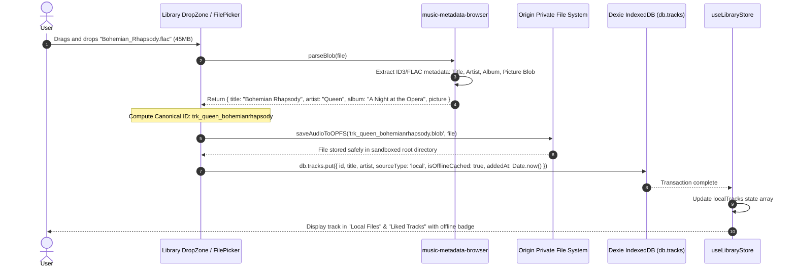
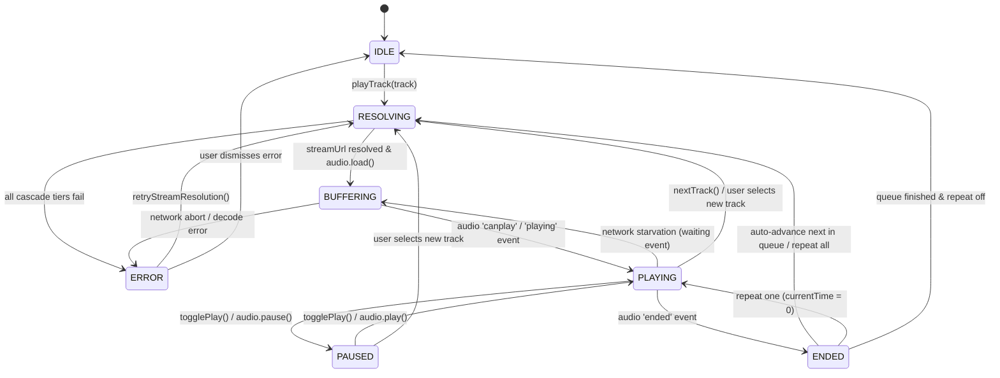
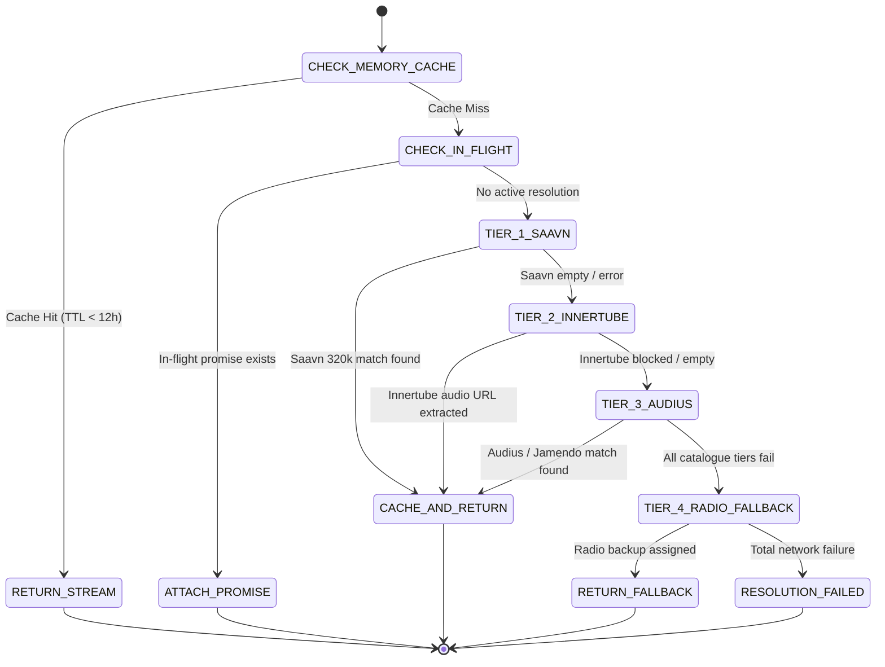

# 🔄 Application Flow & State Machine Architecture (APP FLOW)
## Project: Riff • Universal Music Progressive Web App (PWA)
**Document Version:** 1.0.0  
**Status:** Approved / State Machine Specification  
**Author:** Senior Staff Software Engineer  
**Target Systems:** Client React State, Web Audio Pipeline, BFF Gateway Cascades  

---

## 1. Global User Journey Workflows

---

## 2. Detailed Mermaid Sequence Diagrams

### 2.1 Workflow 1: Application Cold Boot & Guest Ingestion

---

### 2.2 Workflow 2: Search, 3-Layer Deduplication & Hybrid Ranking

---

### 2.3 Workflow 3: Track Playback & Waterfall Stream Resolution

---

### 2.4 Workflow 4: Synchronized Karaoke Lyrics & Tap-to-Seek Loop

---

### 2.5 Workflow 5: Sandboxed Local Audio Ingestion (OPFS + ID3 Parsing)

---

## 3. Finite State Machines (FSM)

### 3.1 Audio Player Lifecycle State Machine

#### Audio Player State Transition Matrix

| Current State | Event Trigger | Next State | System Actions Executed |
|---|---|---|---|
| `IDLE` | `playTrack(track)` | `RESOLVING` | Save active track, show loader skeleton, initiate waterfall resolver. |
| `RESOLVING` | `RESOLVE_SUCCESS(url)` | `BUFFERING` | Assign `audio.src = url`, call `audio.load()`, resume `AudioContext`. |
| `RESOLVING` | `RESOLVE_FAILURE` | `ERROR` | Set error message, trigger toast alert, allow retry. |
| `BUFFERING` | `audio.onplaying` | `PLAYING` | Start timer ticker, sync `MediaSession`, trigger Canvas visualizer. |
| `PLAYING` | `USER_PAUSE` | `PAUSED` | Call `audio.pause()`, freeze visualizer canvas, update OS lockscreen. |
| `PLAYING` | `audio.onwaiting` | `BUFFERING` | Show subtle buffer spinner over play button, keep audio context warm. |
| `PLAYING` | `audio.onended` | `ENDED` | Log listening history to Dexie, check repeat mode, advance queue. |
| `PAUSED` | `USER_RESUME` | `PLAYING` | Call `audio.play()`, resume audio context, start visualizer animation loop. |

---

### 3.2 Waterfall Stream Resolver State Machine

---

## 4. Edge Cases & Fault Tolerance Matrix

| Edge Case | Root Cause | System Detection | Graceful Recovery Action |
|---|---|---|---|
| **AudioContext Autoplay Block** | Browser policy blocks audio without prior user gesture. | `audio.play()` rejects with `NotAllowedError`. | Display unobtrusive glowing "Tap to Resume" overlay; resume on next interaction. |
| **CORS Audio Blocking on Canvas** | Third-party CDN omits `Access-Control-Allow-Origin: *`. | MediaElementSource fails to connect to DSP. | Bypass Web Audio DSP gracefully to ensure direct `<audio>` playback continues smoothly; switch Visualizer to synthetic waveform. |
| **Network Disconnection Mid-Stream** | Subway tunnel / mobile signal drop. | `audio.onerror` fires with `MEDIA_ERR_NETWORK`. | Buffer current chunk, pause playback state, show "Offline - Reconnecting" badge, auto-resume upon `navigator.onLine = true`. |
| **Origin Storage Quota Full** | User downloads dozens of offline FLAC albums. | `navigator.storage.estimate()` returns $>90\%$ usage. | Prompt user with storage drawer, show storage bar, provide 1-tap "Purge Unused Cache" button. |
| **Background Tab Throttling** | Mobile browser suspends requestAnimationFrame. | Canvas visualizer paused by OS. | Visualizer loop automatically throttles to $0\text{ FPS}$ to conserve battery; audio playback continues uninterrupted via native Audio thread. |
| **Typo in Search Query** | User searches "Weknd Blnding Lghts". | Exact match query returns 0 hits. | Multi-tier ranker fires Soundex phonetic match and Levenshtein distance $\le 2$, returning "The Weeknd - Blinding Lights" as top result. |
