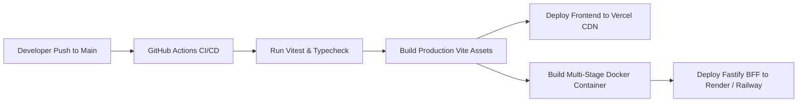

# 🚀 Engineering Implementation Plan & Execution Milestones
## Project: Riff • Universal Music Progressive Web App (PWA)
**Document Version:** 1.0.0  
**Status:** Approved / Execution Ready  
**Lead Architect:** Senior Staff Software Engineer  
**Sprint Cycle:** 6 Engineering Sprints (40 Working Days)  

---

## 1. Project Phasing & Milestone Roadmap

```
+----------------------------------------------------------------------------------------------------+
|                                    RIFF ENGINEERING ROADMAP                                        |
+-------------------+--------------------+--------------------+--------------------+-----------------+
| SPRINT 1 (Days 1-7)| SPRINT 2 (Days 8-14)| SPRINT 3 (15-21)   | SPRINT 4 (22-28)   | SPRINT 5-6 (29-40|
| Base Architecture | Provider Audio Mesh| Client Storage     | UI Studio & Player | PWA Hardening & |
| & Web Audio DSP   | & Waterfall Resolve| OPFS & IndexedDB   | Synced Lyrics + EQ | Testing / Launch|
+-------------------+--------------------+--------------------+--------------------+-----------------+
```

### Phase 1: Core Foundation, App Shell & Web Audio DSP Engine (Days 1 – 7)
* **Goal:** Initialize Vite + React 18 + TypeScript + Tailwind CSS v4 environment. Construct the complete Web Audio DSP graph (`MediaElementAudioSourceNode`, 5-band `BiquadFilterNode` EQ, `GainNode`, `AnalyserNode`) and native `navigator.mediaSession` synchronization.
* **Deliverables:** `src/lib/audioEngine.ts`, `src/stores/usePlayerStore.ts`, `src/components/layout/AppShell.tsx`.

### Phase 2: Global Multi-Provider Audio Mesh & Fastify BFF Gateway (Days 8 – 14)
* **Goal:** Implement the Fastify HTTP/2 BFF server, multi-tier waterfall stream resolution cascade (JioSaavn 320k $\to$ Innertube Android HTTP $\to$ Audius $\to$ Jamendo $\to$ Radio), RFC 7233 Range stream proxy, and LRCLIB lyrics parser.
* **Deliverables:** `server/index.ts`, `server/routes/stream.ts`, `server/services/resolver/precisionYtResolver.ts`, `server/routes/search.ts`.

### Phase 3: Offline Storage Subsystems (OPFS + Dexie IndexedDB) (Days 15 – 21)
* **Goal:** Implement the browser Origin Private File System (OPFS) sandboxed file ingestion for MP3/FLAC local audio files, ID3 tag extraction via WebAssembly/worker, and transactional relational schema in IndexedDB with persistent storage guarantees.
* **Deliverables:** `src/lib/opfs.ts`, `src/lib/db.ts`, `src/stores/useLibraryStore.ts`.

### Phase 4: Fullscreen Studio Player, 60 FPS Visualizer & Synced Lyrics (Days 22 – 28)
* **Goal:** Build the immersive Fullscreen Player modal, 60 FPS Canvas spectrum analyzer, 5-band equalizer drawer, and millisecond-accurate karaoke lyrics renderer with tap-to-seek playback.
* **Deliverables:** `src/components/player/FullscreenPlayerModal.tsx`, `src/components/player/VisualizerCanvas.tsx`, `src/lib/lyrics.ts`.

### Phase 5: PWA Hardening, Service Worker & Offline Caching (Days 29 – 35)
* **Goal:** Configure Workbox Service Worker caching strategies (CacheFirst for static assets, NetworkFirst for API endpoints), PWA Web App Manifest, offline fallback banner, and install prompt triggers.
* **Deliverables:** `vite.config.ts`, `public/manifest.json`, `src/components/common/PwaInstallModal.tsx`.

### Phase 6: QA Testing, Performance Benchmarking & Production Launch (Days 36 – 40)
* **Goal:** Complete 100% test pass rate in Vitest, end-to-end user flow verification, memory profiling ($<65\text{MB}$ RAM), Docker containerization, and production deployment on Vercel and Render.
* **Deliverables:** `tests/audioEngine.test.ts`, `tests/dedup.test.ts`, `Dockerfile`, `render.yaml`.

---

## 2. Detailed Work Breakdown Structure (WBS) & Tasks

| Task ID | Component / Module | Description & Rationale | Assigned Scope | Est. Hours | Dependencies |
|---|---|---|---|---|---|
| **TSK-101** | `lib/audioEngine.ts` | Instantiate singleton Web Audio DSP graph with 5-band biquad filters and AnalyserNode. | Audio Core | 14h | None |
| **TSK-102** | `stores/usePlayerStore.ts` | Build Zustand store managing queue, playback state, and MediaSession sync. | Client State | 12h | TSK-101 |
| **TSK-103** | `components/layout/AppShell.tsx` | Construct responsive 3-panel desktop and mobile layout with floating cards. | UI Layout | 10h | None |
| **TSK-201** | `server/services/resolver` | Implement 5-tier stream resolution waterfall with in-flight deduplication. | Backend BFF | 16h | None |
| **TSK-202** | `server/routes/stream.ts` | Implement RFC 7233 HTTP 206 Partial Content Range streaming proxy. | Backend BFF | 12h | TSK-201 |
| **TSK-203** | `src/lib/dedup.ts` | Build 3-layer string normalization and FNV-1a canonical hash deduplication. | Algorithms | 8h | None |
| **TSK-204** | `src/lib/searchRanking.ts`| Build multi-tier search ranking with Soundex phonetic scoring and Levenshtein. | Algorithms | 10h | TSK-203 |
| **TSK-301** | `src/lib/opfs.ts` | Create OPFS file stream reader/writer for sandboxed local MP3/FLAC storage. | Storage Core | 14h | None |
| **TSK-302** | `src/lib/db.ts` | Configure Dexie.js IndexedDB tables for tracks, playlists, lyrics, and history. | Storage Core | 10h | None |
| **TSK-303** | `stores/useLibraryStore.ts` | Implement library actions (add playlist, like track, import local files). | Client State | 12h | TSK-301, 302 |
| **TSK-401** | `player/FullscreenModal` | Build glassmorphic fullscreen modal with vinyl artwork shadow and glow. | UI Player | 14h | TSK-102 |
| **TSK-402** | `player/VisualizerCanvas` | Implement 60 FPS requestAnimationFrame Canvas spectrum visualizer. | UI Player | 10h | TSK-101 |
| **TSK-403** | `lib/lyrics.ts` | Build millisecond .LRC parser with binary search active line tracking. | UI Lyrics | 8h | None |
| **TSK-501** | `vite.config.ts` | Configure `vite-plugin-pwa` with Workbox offline caching and manifest. | PWA Infra | 8h | None |
| **TSK-601** | `tests/*.test.ts` | Write and execute comprehensive Vitest unit tests for audio, dedup, and DB. | QA / Testing | 16h | All Tasks |

---

## 3. Verification & Quality Assurance Strategy

### 3.1 Automated Vitest Test Suite
Execute all unit and integration tests across the core subsystems:
```bash
npm test
```

#### Test Coverage Targets:
* **Audio Engine DSP:** 100% method coverage for play, pause, seek, volume, EQ filter gains, and analyser frequency buffers.
* **Deduplication Engine:** 100% coverage verifying that video tags (`(Official Video)`, `[HQ]`, `4K Remaster`) are cleanly stripped and duplicate tracks cluster into single canonical IDs.
* **Search Ranking Engine:** Verification of exact, prefix, substring, Soundex phonetic, and Levenshtein fuzzy match scoring.
* **IndexedDB Schema:** Verification of ACID create, read, update, and delete transactions.

### 3.2 Performance & Memory Benchmarks
* **Memory Heap Audit:** Measure Chrome DevTools Heap allocation during 2 hours of continuous playback. Target: $<60\text{MB}$.
* **Frame Rate Profiling:** Verify Canvas Visualizer and smooth lyric scroll maintain $60\text{ FPS}$ using Chrome Performance Profiler.
* **Offline Verification:** Disconnect network in DevTools (`Offline` throttling) and verify all cached OPFS and IndexedDB tracks play instantly.

---

## 4. CI/CD & Production Deployment Architecture



### 4.1 Production Multi-Stage Dockerfile
```dockerfile
# Stage 1: Build Frontend and Backend TypeScript
FROM node:20-alpine AS builder
WORKDIR /app
COPY package*.json tsconfig*.json ./
RUN npm ci
COPY . .
RUN npm run build

# Stage 2: Production Lightweight Runtime
FROM node:20-alpine AS runner
WORKDIR /app
ENV NODE_ENV=production
COPY package*.json ./
RUN npm ci --only=production
COPY --from=builder /app/dist ./dist
COPY --from=builder /app/server ./server
EXPOSE 3080
CMD ["node", "--loader", "tsx", "server/index.ts"]
```

---

## 5. Risk Assessment & Technical Mitigation Matrix

| Identified Risk | Severity | Probability | Mitigation Strategy |
|---|---|---|---|
| **Upstream Provider Rate Limiting** | High | Low | In-memory 12-hour resolution cache + 5-tier waterfall cascade prevents duplicate upstream API hits. |
| **CORS Audio Blocking on Canvas Visualizer** | Medium | Medium | Automated try-catch fallback: if `createMediaElementSource` fails, direct audio plays smoothly while visualizer renders synthetic trigonometric waves. |
| **Browser Storage Eviction** | High | Low | Explicitly invoke `navigator.storage.persist()` on app boot to protect IndexedDB and OPFS from browser quota eviction. |
| **Mobile Browser AudioContext Suspension** | Medium | High | Bind automatic `.resume()` call on the first user interaction (`play`, `seek`, `click`). |
