# 🛠️ Technical Requirements Document (TRD)
## Project: Riff • Universal Music Progressive Web App (PWA)
**Document Version:** 1.0.0  
**Status:** Approved / Architecture Baseline  
**Lead Architect:** Senior Staff Software Engineer  
**Target Platform:** Modern Web (Chromium, WebKit, Gecko), PWA, Node.js Fastify BFF Gateway  

---

## 1. System Architecture & Topology

Riff follows a **decoupled Client-Heavy PWA + Ultra-Lean BFF (Backend-for-Frontend) Gateway** topology. Heavy computing (audio digital signal processing, canvas visual rendering, ID3 tag extraction, fuzzy search ranking, and local file storage) is performed entirely on the client. The BFF server acts exclusively as an asynchronous aggregator, stream decrypter, and HTTP Range streaming proxy.

```mermaid
graph TB
    subgraph ClientLayer ["Client Layer: PWA Single Page Application (React 18 + Vite)"]
        UI["UI Component Tree (AppShell, MiniPlayer, FullscreenModal, Lyrics, Visualizer)"]
        State["State Management: Zustand Stores (Player, Library, Settings, Auth)"]
        DSP["RiffAudioEngine: HTML5 Audio + Web Audio DSP Graph"]
        OPFS_FS[("Origin Private File System (OPFS): Sandboxed Audio Files")]
        IDB_DB[("Dexie IndexedDB: Relational Metadata & Sync Log")]
        SW_Cache["Service Worker: CacheStorage & Network Interceptor"]
        
        UI --> State
        State --> DSP
        UI --> DSP
        State --> IDB_DB
        State --> OPFS_FS
        UI <--> SW_Cache
    end

    subgraph BFFLayer ["BFF Gateway Layer: Fastify HTTP/2 Server (Port 3080)"]
        Router["Fastify Routing, CORS & Rate Limiting"]
        StreamProxy["HTTP Range Stream Proxy (RFC 7233 206 Partial Content)"]
        Waterfall["Multi-Tier Waterfall Stream Resolver"]
        RankEngine["Spotify-Style Search & Vibe Ranking Engine"]
        DedupEngine["SDCCE 3-Layer Deduplication Engine"]
        MemCache[("In-Memory Resolution Cache (12h TTL)")]

        Router --> RankEngine
        Router --> Waterfall
        Router --> StreamProxy
        Waterfall <--> MemCache
        RankEngine --> DedupEngine
    end

    subgraph ExternalMesh ["Global Multi-Provider Audio Mesh (GMPAM)"]
        SaavnAPI["JioSaavn Open Engine (320kbps MP3 CDN)"]
        InnertubeAPI["YouTube Music Innertube Android Client (HTTP Audio)"]
        AudiusAPI["Audius Decentralized Catalog API"]
        JamendoAPI["Jamendo Creative Commons API"]
        RadioAPI["Radio Browser Worldwide Network (30k+ Stations)"]
        LRCLIBAPI["LRCLIB Millisecond Synced Lyrics Database"]
        AppleAPI["Apple Music / iTunes Metadata Catalog"]
        DeezerAPI["Deezer Lossless Metadata Engine"]

        RankEngine --> AppleAPI
        RankEngine --> DeezerAPI
        RankEngine --> SaavnAPI
        Waterfall --> SaavnAPI
        Waterfall --> InnertubeAPI
        Waterfall --> AudiusAPI
        Waterfall --> JamendoAPI
        Waterfall --> RadioAPI
        Router --> LRCLIBAPI
    end

    DSP <-->|Direct CDN / Proxied Audio Stream| StreamProxy
    State <-->|JSON REST API| Router
```



---

## 2. Frontend Technical Stack & Component Architecture

### 2.1 Technology Matrix
* **Core Framework:** React 18.3.1 with StrictMode enabled.
* **Build Tooling:** Vite 6.0.7 with `@vitejs/plugin-react` and `@tailwindcss/vite`.
* **Language:** TypeScript 5.7.2 in strict mode (`"strict": true`, `"noImplicitAny": true`).
* **Styling System:** Tailwind CSS v4.0.0 (Native CSS engine with custom obsidian tokens).
* **State Management:** Zustand 5.0.3 with lightweight selective subscriptions.
* **Local Database:** Dexie 4.0.10 (IndexedDB wrapper with ACID transaction guarantees).
* **Metadata Extraction:** `music-metadata-browser` 2.5.11 (WebWorker/WebAssembly ID3 parser).
* **Iconography:** `lucide-react` 0.474.0 tree-shakeable SVG icons.

### 2.2 Zustand Store Partitioning

To prevent unnecessary React re-renders, client state is partitioned into 4 distinct, isolated domain stores:

```
src/stores/
├── usePlayerStore.ts    # Audio state, active track, queue, playback progress, Web Audio sync
├── useLibraryStore.ts   # User playlists, liked songs, history, OPFS local track imports
├── useSettingsStore.ts  # Audio quality, equalizer bands, data saver, theme preferences
└── useAuthStore.ts      # Guest state, session token, cloud sync migration state
```

#### Store State Interface: `usePlayerStore`
```typescript
interface PlayerStoreState {
  currentTrack: Track | null;
  queue: Track[];
  queueIndex: number;
  playbackState: 'idle' | 'resolving' | 'buffering' | 'playing' | 'paused' | 'error';
  currentTime: number;
  duration: number;
  volume: number;
  isMuted: boolean;
  isShuffle: boolean;
  repeatMode: 'off' | 'all' | 'one';
  activeMainView: 'home' | 'search' | 'library' | 'artist' | 'playlist';
  isFullscreenPlayerOpen: boolean;
  isLyricsOpen: boolean;
  isVisualizerActive: boolean;
  
  // Actions
  playTrack: (track: Track, newQueue?: Track[]) => Promise<void>;
  togglePlay: () => Promise<void>;
  nextTrack: () => void;
  prevTrack: () => void;
  seek: (seconds: number) => void;
  setVolume: (val: number) => void;
  toggleShuffle: () => void;
  cycleRepeat: () => void;
  initAudioListeners: () => void;
}
```

---

## 3. Web Audio Digital Signal Processing (DSP) Subsystem

### 3.1 Web Audio Node Graph Topology
The audio pipeline is structured around a real-time Web Audio API node graph with cross-origin safety:

```
[ HTML5 <audio> Element (crossOrigin = 'anonymous') ]
                         │
                         ▼
           [ MediaElementAudioSourceNode ]
                         │
                         ▼
        [ 5-Band BiquadFilter Equalizer ]
        ├── Filter 0: 60 Hz   (type: 'lowshelf', gain: ±12dB)
        ├── Filter 1: 250 Hz  (type: 'peaking',   gain: ±12dB, Q: 1.0)
        ├── Filter 2: 1000 Hz (type: 'peaking',   gain: ±12dB, Q: 1.0)
        ├── Filter 3: 4000 Hz (type: 'peaking',   gain: ±12dB, Q: 1.0)
        └── Filter 4: 14000 Hz(type: 'highshelf', gain: ±12dB)
                         │
                         ▼
                    [ GainNode ] (Master Volume Clamp 0.0 - 1.0)
                         │
                         ▼
                  [ AnalyserNode ] (fftSize: 128, smoothingTimeConstant: 0.8)
                    ├── ByteFrequencyData ──> Canvas 60 FPS Visualizer
                    │
                    ▼
           [ AudioContext.destination ] (Hardware DAC / Speaker)
```

### 3.2 Canvas 60 FPS Visualizer Engine
* **FFT Resolution:** `fftSize = 128` producing 64 discrete frequency bins ($0\text{Hz}\sim22.05\text{kHz}$).
* **Smoothing Factor:** $0.80$ to eliminate jitter while maintaining punchy bass response.
* **Fallback Animation:** If the AudioContext is suspended or cross-origin restrictions isolate the analyser, the visualizer automatically generates smooth mathematical trigonometric wave vectors ($f(t) = |\sin(t + i \cdot 0.2)| \cdot 180 + 40$) to prevent UI freezing.

---

## 4. Storage Architecture & Offline Engine

### 4.1 Storage Tiering Strategy

| Tier | Storage Engine | Purpose | Persistence Guarantee | Performance |
|---|---|---|---|---|
| **Tier 1** | **OPFS (Origin Private File System)** | High-throughput storage for user-imported MP3/FLAC audio blobs. | Permanent (sandboxed private file tree). | Direct disk read stream ($0\text{ RAM}$ overhead). |
| **Tier 2** | **IndexedDB (Dexie.js)** | Relational structured metadata (Tracks, Playlists, Liked Songs, Lyrics, History). | High (`navigator.storage.persist()` protected). | Sub-5ms indexed queries with B-Tree indexes. |
| **Tier 3** | **CacheStorage (Service Worker)** | Offline static application shell, web fonts, and static assets. | Standard PWA Cache SLA. | Instant offline boot ($<50\text{ms}$). |
| **Tier 4** | **In-Memory Zustand** | Ephemeral active player state, live queue, and transient visualizer buffers. | Session lifetime. | Instant reactive read/write ($<0.1\text{ms}$). |

### 4.2 Origin Private File System (OPFS) Implementation
```typescript
// Sandboxed file ingestion into OPFS
export async function saveAudioToOPFS(fileKey: string, file: File | Blob): Promise<string> {
  const root = await navigator.storage.getDirectory();
  const audioDir = await root.getDirectoryHandle('riff_audio', { create: true });
  const fileHandle = await audioDir.getFileHandle(fileKey, { create: true });
  
  const writable = await fileHandle.createWritable();
  await writable.write(file);
  await writable.close();
  return fileKey;
}

export async function getAudioStreamFromOPFS(fileKey: string): Promise<string> {
  const root = await navigator.storage.getDirectory();
  const audioDir = await root.getDirectoryHandle('riff_audio');
  const fileHandle = await audioDir.getFileHandle(fileKey);
  const file = await fileHandle.getFile();
  return URL.createObjectURL(file);
}
```

---

## 5. BFF Gateway & Multi-Tier Stream Resolution Engine

### 5.1 Waterfall Resolution Algorithm
When a track is requested for playback, the BFF Gateway executes a multi-tier cascade to resolve a high-bitrate, playable stream:

```
[ Request: Title, Artist, Duration, RawUrl ]
                   │
                   ▼
       1. Memory Cache Lookup (Key: norm_artist___norm_title, TTL: 12h)
          ├── Cache Hit: Return stream URL instantly (< 1ms)
          └── Cache Miss: Continue
                   │
                   ▼
       2. In-Flight Deduplication Map
          ├── Pending Promise Active: Attach to existing promise
          └── No Pending Resolution: Initiate cascade
                   │
                   ▼
       3. Direct CDN Validation (Saavn / Audius / Jamendo direct URLs)
          └── If URL is valid & reachable: Return direct CDN URL (0ms)
                   │
                   ▼
       4. Tier 1: High-Speed JioSaavn 320kbps CDN Lookup (~120ms)
          └── Query: "${artist} ${title}" -> Match duration -> Return 320k MP3
                   │
                   ▼ (Fallback on no match)
       5. Tier 2: YouTube Music Innertube Android Client (~180ms)
          └── Pure HTTP JSON protocol -> Extract direct Googlevideo Audio Stream
                   │
                   ▼ (Fallback on no match)
       6. Tier 3: Audius / Jamendo Open Catalog (~220ms)
                   │
                   ▼ (Fallback on all failures)
       7. Tier 4: High-Fidelity Worldwide Radio Live Stream Fallback
```

### 5.2 HTTP Range Stream Proxy
To bypass browser CORS limitations and ISP throttling on certain raw stream CDNs, the BFF includes an RFC 7233 compliant stream proxy:
* **Headers Forwarded:** `Range`, `Accept-Ranges`, `Content-Range`, `Content-Length`, `Content-Type`.
* **Status Codes:** Returns `206 Partial Content` for range requests; `200 OK` for complete stream buffers.
* **Connection Pooling:** Uses `axios` with keep-alive agent pooling to minimize TCP handshake overhead.

---

## 6. Deduplication & Search Ranking Mathematics

### 6.1 3-Layer Deduplication Engine (SDCCE)
To eliminate duplicate tracks returned across 7 parallel providers:
1. **String Normalization:** Strips video prefixes/suffixes, official video tags, 4K remaster tags, and `feat.` patterns:
   $$\text{NormTitle} = \text{clean}(\text{Title})$$
2. **Duration Bucketing (3-Second Tolerance):**
   $$\text{Bucket}(\text{duration}) = \left\lfloor \frac{\text{duration} + 1.5}{3} \right\rfloor$$
3. **Deterministic FNV-1a Hash Canonical ID:**
   $$\text{RawKey} = \text{NormArtist} + \text{"\_"} + \text{NormTitle} + \text{"\_"} + \text{Bucket}(\text{duration})$$
   $$\text{Hash}_{i} = (\text{Hash}_{i-1} \oplus \text{Byte}_{i}) \times 16777619 \pmod{2^{32}}$$
   $$\text{CanonicalTrackID} = \text{"trk\_"} + \text{hex}(\text{Hash})$$

### 6.2 Multi-Tier Search Ranking Algorithm
Tracks are scored across 7 distinct algorithmic criteria:

$$\text{RelevanceScore} = S_{\text{match}} + S_{\text{phonetic}} + S_{\text{fuzzy}} + S_{\text{bonus}}$$

* **Exact Match:** $S_{\text{match}} = 150$ (Title) or $130$ (Artist).
* **Prefix Match:** $S_{\text{match}} = 110$ (Title) or $100$ (Artist).
* **Substring Containment:** $S_{\text{match}} = 85$.
* **Token Intersection:** $S_{\text{match}} = 50 + \left(\frac{N_{\text{matched}}}{N_{\text{total}}}\right) \times 35$.
* **Phonetic Soundex Match:** $S_{\text{phonetic}} = 55$ if $\text{Soundex}(q) = \text{Soundex}(title)$.
* **Levenshtein Distance Penalty:** $S_{\text{fuzzy}} = \max(0, 45 - 10 \times \text{Levenshtein}(q, title))$.
* **Metadata Quality Bonuses:** $+5$ (Bitrate $\ge 320\text{kbps}$), $+3$ (Synced Lyrics present), $+2$ (High-res artwork).

---

## 7. Performance Budgets & Latency SLA

| Operation | Target Budget (P50) | Target Budget (P95) | Max Allowed (P99) |
|---|---|---|---|
| Static PWA Boot Time | $< 250\text{ms}$ | $< 400\text{ms}$ | $< 650\text{ms}$ |
| Search Query Execution | $< 180\text{ms}$ | $< 350\text{ms}$ | $< 600\text{ms}$ |
| Stream Resolution (Cached) | $< 1\text{ms}$ | $< 5\text{ms}$ | $< 10\text{ms}$ |
| Stream Resolution (Uncached Tier 1) | $< 140\text{ms}$ | $< 280\text{ms}$ | $< 450\text{ms}$ |
| Web Audio Filter Frequency Update | $< 0.1\text{ms}$ | $< 0.5\text{ms}$ | $< 1.0\text{ms}$ |
| Canvas Visualizer Frame Time | $14.2\text{ms}$ ($70\text{ FPS}$) | $16.6\text{ms}$ ($60\text{ FPS}$) | $20.0\text{ms}$ ($50\text{ FPS}$) |
| IndexedDB Track Read / Write | $< 2\text{ms}$ | $< 6\text{ms}$ | $< 15\text{ms}$ |
| OPFS 50MB Audio File Ingestion | $< 120\text{ms}$ | $< 250\text{ms}$ | $< 500\text{ms}$ |

---

## 8. Security & Environment Configuration

### 8.1 Content Security Policy (CSP) Directives
```http
Content-Security-Policy: default-src 'self'; script-src 'self' 'unsafe-inline'; style-src 'self' 'unsafe-inline' https://fonts.googleapis.com; font-src 'self' https://fonts.gstatic.com; media-src 'self' blob: data: https://*.saavncdn.com https://*.audius.co https://*.jamendo.com https://*.googlevideo.com https://*.zeno.fm; img-src 'self' blob: data: https: http:; connect-src 'self' blob: data: https:;
```

### 8.2 Environment Variables Matrix
```env
# Server Runtime
PORT=3080
HOST=0.0.0.0
NODE_ENV=production

# BFF Cache Configuration
SEARCH_CACHE_TTL_MS=900000        # 15 Minutes
STREAM_CACHE_TTL_MS=43200000      # 12 Hours

# Upstream Provider Configuration
SAAVN_API_BASE=https://saavn.dev
AUDIUS_APP_NAME=RiffUniversalMusic
LRCLIB_API_BASE=https://lrclib.net/api
```
